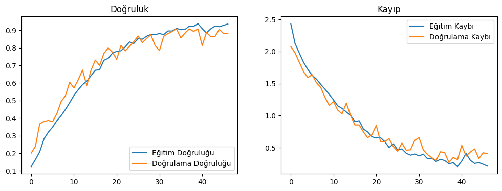
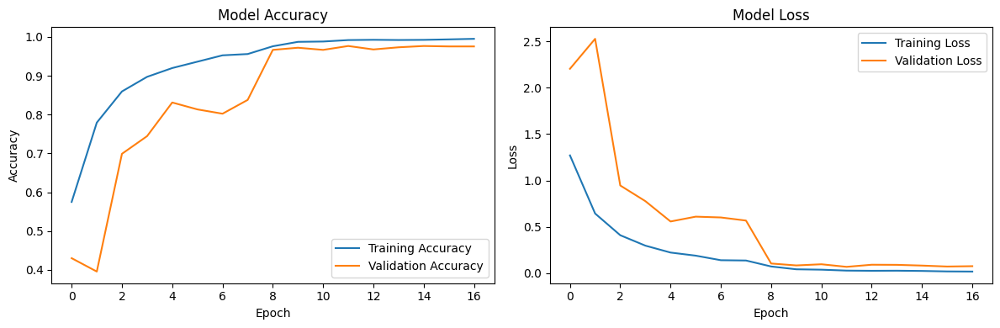

# Balık Türü Sınıflandırma Projesi

Bu proje, farklı balık türlerini sınıflandırmak için yapay sinir ağı (Artificial Neural Network - ANN) mimarisi kullanılarak geliştirildi. Proje kapsamında, önce basit bir ANN modeli oluşturulmuş, ardından **Keras Tuner** ile hiperparametre optimizasyonu yapılarak modelin performansı iyileştirilmiştir.

## Proje Genel Bakış

- **Amacı**: Çeşitli balık türlerinin doğru bir şekilde sınıflandırılması için yapay sinir ağı tabanlı bir model geliştirmek.
- **Veri Seti**: Çeşitli balık türlerine ait görsel ve metinsel veriler içeren bir veri seti kullanılmıştır. Bu türler arasında Deniz Levreği, Kırmızı Barbun, Karides gibi türler yer almaktadır.
- **Yöntem**: Öncelikle, basit bir ANN mimarisi ile bir model eğitildi. Daha sonra, modelin performansını artırmak için **Keras Tuner** kullanılarak hiperparametre optimizasyonu yapıldı.

## Model Mimarisinin Oluşturulması

### Basit ANN Mimarisi

İlk aşamada, ANN mimarisi aşağıdaki gibi yapılandırılmıştır:

- **Girdi Katmanı**: Veri setindeki özelliklere göre giriş katmanı oluşturulmuştur.
- **Gizli Katmanlar**: Dört gizli katman kullanılmıştır, her birinde 256,128,256,128ve 64 nöron vardır.
- **Dropout**: Her iki gizli katmandan sonra dropout kullanılmıştır. Değerleri 0.5 ve 0.3'tür. Modelin aşırı öğrenmesini önlemek için kullanılmıştır.
- **Çıkış Katmanı**: Balık türlerine göre sınıflandırma yapmak için `softmax` aktivasyon fonksiyonuna sahip bir çıkış katmanı oluşturulmuştur.
- **Optimizasyon**: İlk modelde standart `adam` optimizatörü kullanılmıştır.
- **Kaybı Azaltma**: `categorical_crossentropy` kayıp fonksiyonu ile model eğitilmiştir.

Modelin eğitimi sonucunda elde edilen **sınıflandırma raporu** şu şekildedir:

| Tür                 | Precision | Recall | F1-Score | Support |
|---------------------|-----------|--------|----------|---------|
| Hamsi (Horse Mackerel)| 0.82      | 0.97   | 0.89     | 100     |
| Karadeniz İstavrit   | 0.89      | 0.90   | 0.90     | 100     |
| Deniz Levreği        | 0.94      | 0.93   | 0.93     | 100     |
| Kırmızı Barbun       | 0.98      | 0.96   | 0.97     | 100     |
| Alabalık             | 0.90      | 0.97   | 0.93     | 100     |
| Çizgili Kırmızı Barbun| 0.91     | 0.75   | 0.82     | 100     |
| Karides              | 0.97      | 0.91   | 0.94     | 100     |
| Çipura (Gilt-Head Bream) | 0.82   | 0.89   | 0.86     | 100     |
| Kırmızı Orfoz        | 0.86      | 0.79   | 0.82     | 100     |

- **Genel Doğruluk**: %90
- **Makro Ortalama**: %90
- **Ağırlıklı Ortalama**: %90

### Hiperparametre Optimizasyonu Sonrası ANN

İkinci aşamada, modelin performansını artırmak amacıyla **Keras Tuner** kullanılarak hiperparametre optimizasyonu gerçekleştirilmiştir. Optimizasyon yapılan parametreler şunlardır:

- **Katman Sayısı**: Gizli katman sayısı artırılmıştır.
- **Nöron Sayısı**: Gizli katmanlardaki nöron sayıları değiştirilmiştir.
- **Öğrenme Oranı (Learning Rate)**: Modelin daha verimli öğrenmesi için öğrenme oranı optimize edilmiştir.
- **Aktivasyon Fonksiyonları**: Gizli katmanlardaki aktivasyon fonksiyonları optimize edilmiştir.
- **Batch Size (Toplu İşlem Boyutu)**: Her bir eğitim adımında işlenen veri miktarı optimize edilmiştir.

Hiperparametre optimizasyonu sonrasında modelin performansı önemli ölçüde iyileşmiştir. Elde edilen sınıflandırma raporu şu şekildedir:

| Tür                 | Precision | Recall | F1-Score | Support |
|---------------------|-----------|--------|----------|---------|
| Hamsi (Horse Mackerel)| 0.97      | 0.97   | 0.97     | 100     |
| Karadeniz İstavrit   | 0.97      | 0.97   | 0.97     | 100     |
| Deniz Levreği        | 0.98      | 0.97   | 0.97     | 100     |
| Kırmızı Barbun       | 0.96      | 0.99   | 0.98     | 100     |
| Alabalık             | 0.97      | 0.98   | 0.98     | 100     |
| Çizgili Kırmızı Barbun| 0.94     | 0.97   | 0.96     | 100     |
| Karides              | 0.99      | 0.98   | 0.98     | 100     |
| Çipura (Gilt-Head Bream) | 0.99   | 1.00   | 1.00     | 100     |
| Kırmızı Orfoz        | 0.99      | 0.93   | 0.96     | 100     |

- **Genel Doğruluk**: %97
- **Makro Ortalama**: %97
- **Ağırlıklı Ortalama**: %97

### Optimizasyon Öncesi ve Sonrası Karşılaştırma

Optimizasyon sonrası modelde aşağıdaki iyileşmeler gözlemlenmiştir:
- **Genel Doğruluk** %90'dan %97'ye yükselmiştir.
- Özellikle **Karides** ve **Çipura** gibi türlerde precision ve recall oranları belirgin şekilde iyileşmiştir.
- Optimizasyon ile hem doğruluk hem de sınıflandırma performansında genel bir artış sağlanmıştır.

## Model Değerlendirmesi

Modelin performansı aşağıdaki metriklerle değerlendirilmiştir:
- **Doğruluk (Accuracy)**: Toplam doğru tahminlerin tüm tahminlere oranı.
- **Precision (Kesinlik)**: Doğru pozitif tahminlerin, toplam pozitif tahminlere oranı.
- **Recall (Duyarlılık)**: Gerçek pozitif tahminlerin, toplam gerçek pozitif gözlemlere oranı.
- **F1-Score**: Precision ve recall'un dengeli bir ortalamasıdır.

### Doğruluk ve Kayıp Grafikleri

Aşağıdaki grafiklerle modelin eğitimi boyunca doğruluk ve kayıp (loss) değerlerindeki değişimi gözlemleyebilirsiniz. Özellikle hiperparametre optimizasyonu sonrası eğitim ve doğrulama sonuçlarının karşılaştırması model performansını anlamak açısından faydalıdır. Hiperparametre optimizasyonu öncesi ve sonrası eğitim ve doğrulama sonuçlarının karşılaştırması:

Öncesi;

Sonrası;


## Projeyi Çalıştırma

1. Reponuzu klonlayın:
   ```bash
   git clone https://github.com/alialtunoglu/FishClassification
   ```
2. Notebook'u çalıştırın:
   Jupyter'de `.ipynb` dosyasını açabilir veya projeyi **Kaggle** üzerinde çalıştırabilirsiniz.

## Kaggle Notebook

Daha fazla detay ve projeyi Kaggle üzerinde çalıştırmak için [buraya tıklayın](https://www.kaggle.com/code/alialtunoglu/fishdataset).

---
